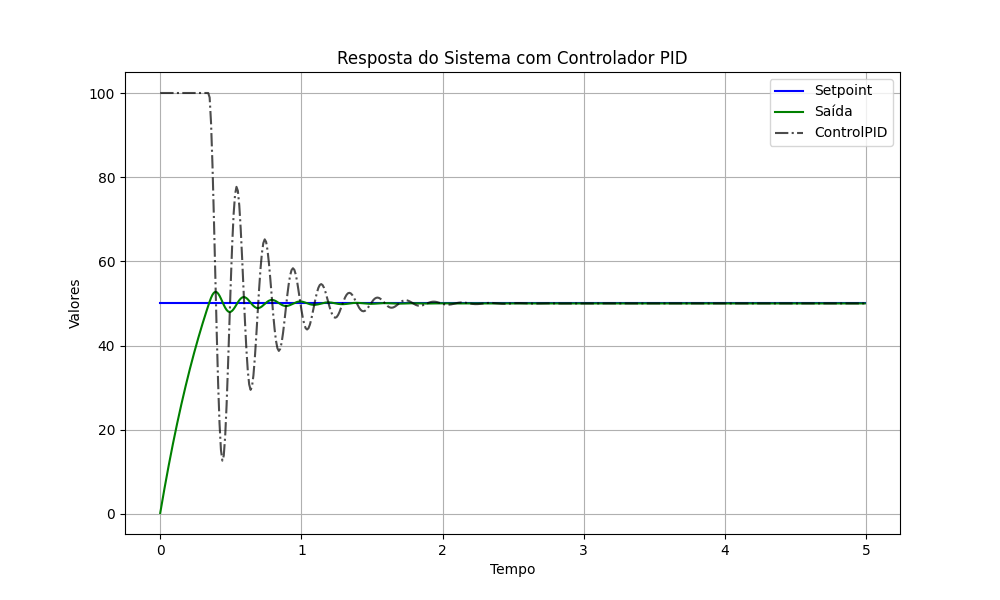

# Controlador PID Discreto

Este projeto implementa um controlador PID (Proporcional-Integral-Derivativo) discreto em C++ e demonstra seu uso em um sistema de primeira ordem simulado.

## Descrição

O controlador PID é um mecanismo de controle amplamente utilizado em sistemas industriais e aplicações que exigem controle contínuo e automatizado. Este projeto fornece uma implementação completa e flexível de um controlador PID discreto para ser usado em sistemas em tempo real.

Características principais:
- Implementação completa em C++ de um controlador PID discreto
- Ajustes independentes dos ganhos proporcional, integral e derivativo
- Anti-windup para evitar saturação do termo integral
- Limites de saída configuráveis
- Tempo de amostragem ajustável
- Cálculo do termo derivativo baseado na medida (não no erro) para reduzir spikes

## Requisitos

- Compilador C++ com suporte ao padrão C++17
- CMake versão 3.10 ou superior
- Python 3 com as bibliotecas matplotlib e pandas (para visualização dos resultados)

## Estrutura do Projeto

```
PID-discreto/
├── include/                # Arquivos de cabeçalho
│   └── project/
│       └── PID.h           # Classe PID
├── src/
│   ├── main.cpp            # Programa principal de demonstração
│   └── project/
│       └── PID.cpp         # Implementação da classe PID
│   └── utils/
│       └── plots.py        # Script para visualização de resultados
├── CMakeLists.txt          # Configuração do CMake
└── README.md               # Este arquivo
```

## Compilação e Execução

### Compilar o projeto

```bash
# Criar e entrar no diretório build
mkdir -p build
cd build

# Configurar e compilar
cmake ..
make
```

### Executar a simulação

```bash
# Na pasta build
./pid-discreto > resultados.csv
```

### Visualizar os resultados

```bash
# Na pasta raiz do projeto
python3 src/utils/plots.py build/resultados.csv
```

## Exemplo de Uso

```cpp
#include "project/PID.h"

// Criar controlador PID com ganhos configurados
// Argumentos: kp, ki, kd, tempo de amostragem, saída mínima, saída máxima
PID pid(2.0, 0.5, 0.1, 0.01, -100.0, 100.0);

// Definir o setpoint (valor desejado)
pid.setSetpoint(50.0);

// Computar a ação de controle baseada na medição atual
double measurement = getSensorValue();
double controlSignal = pid.compute(measurement);
```

## Ajuste dos Parâmetros PID

Os parâmetros PID (kp, ki, kd) podem precisar de ajustes para cada aplicação específica:

- **kp** (ganho proporcional): Controla a resposta imediata ao erro. Valores maiores levam a uma resposta mais rápida, mas podem causar instabilidade.
  
- **ki** (ganho integral): Elimina o erro em regime permanente. Valores maiores eliminam o erro mais rapidamente, mas podem causar oscilações.
  
- **kd** (ganho derivativo): Melhora a estabilidade e reduz oscilações. Valores maiores aumentam o amortecimento, mas podem amplificar ruídos.

## Simulação do Sistema

O projeto inclui uma função de simulação para um sistema de primeira ordem, permitindo testar o controlador PID:

```cpp
double simulateSystem(double input, double& lastOutput, double timeConstant, double gain, double sampleTime);
```

Parâmetros do sistema:
- **timeConstant**: Constante de tempo do sistema (valores maiores resultam em respostas mais lentas)
- **gain**: Ganho estático do sistema
- **sampleTime**: Tempo de amostragem em segundos

## Visualização dos Resultados

O script Python `plots.py` gera gráficos com os resultados da simulação:
- Setpoint (valor desejado)
- Saída do sistema (resposta)
- Sinal de controle (ação do PID)

### Exemplo de Resposta



*Figura 1: Exemplo de resposta do sistema controlado por PID.*

## Licença

[MIT License](https://opensource.org/licenses/MIT)

## Autor

Diego Ferruzzo

## Referências

- Åström, K.J. e Hägglund, T. "PID Controllers: Theory, Design, and Tuning"
- Phillips, C.L. e Harbor, R.D. "Feedback Control Systems"